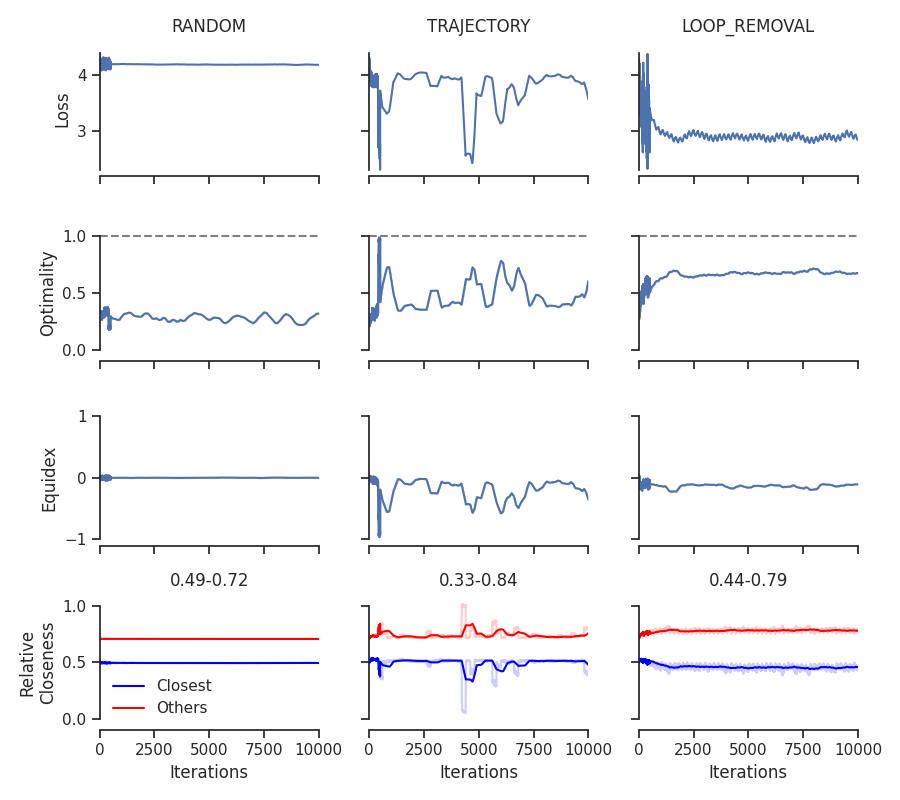
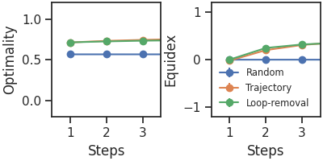

Aquí tienes el archivo completo en formato Markdown listo para copiar y pegar:  

# Goal Reduction with Loop-Removal Accelerates RL and Models Human Brain Activity in Goal-Directed Learning

This repository reproduces the results from the paper:

**"[Goal Reduction with Loop-Removal Accelerates RL and Models Human Brain Activity in Goal-Directed Learning](https://neurips.cc/virtual/2024/poster/94732)"**

Original repository: [chenghuzi/goal-reducer](https://github.com/chenghuzi/goal-reducer.git)

## Getting Started

### Clone the Repository

Clone this repository to get started:
```bash
git clone https://github.com/leoperezz/GoalReducerWithLoopRemoval.git
cd GoalReducerWithLoopRemoval
```

### Install Dependencies

Ensure you have Python installed and install the required dependencies:
```bash
pip install -r requirements.txt
```

## Reproducing Results

### Figure 2: Training and Visualization

#### Step 1: Training

Make the training script executable and run it:
```bash
chmod +x scripts/run_sampling_strategies/train.sh
./scripts/run_sampling_strategies/train.sh
```

Below is the visualization of the results obtained during training:



**Parameters used:**
- `seed=0`
- `gr=VAE`
- `lr=5e-4`
- `cores=8`
- `graph=RD`
- `walk_repeats=50`
- `scalfactor=1.0`
- `klw=0.01`

#### Step 2: Visualization

After training, you can visualize the results by running the analysis script:
```bash
chmod +x scripts/run_sampling_strategies/analyze.sh
./scripts/run_sampling_strategies/analyze.sh
```

Below is the visualization of the analyzed data:



**Parameters used:**
- `seed=0`
- `gr=VAE`
- `graph=RD`
- `klw=0.01`